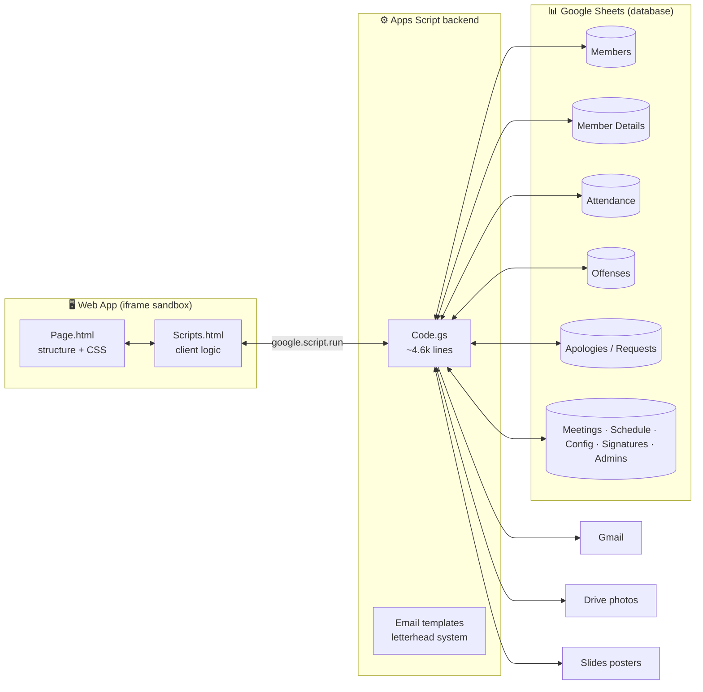

<div align="center">

# 🎼 Strathmore Chorale — Attendance & Membership System

**One voice from many. One system for all of it.**

A full-featured attendance, membership, and celebrations platform for a 100+ member
performing-arts organization — built entirely on Google Apps Script + Google Sheets,
with zero hosting costs and enterprise-grade features.


</div>

---

## ✨ What it does

| | Feature | Highlights |
| --- | --- | --- |
| 🗓️ | **Attendance recording** | Five-status model (Present · Late Excused · Late Unexcused · Absent Excused · Absent Unexcused), multi-section sessions, meeting support, overwrite-safe re-recording |
| 📊 | **Group Dashboard** | Attendance rate & trend chart with hover analytics, per-session averages, momentum indicator (improving/declining), absenteeism rate, apology analytics |
| 🧾 | **Sessions hub** | Every practice & meeting with stats, editable registers, CSV export |
| ⚖️ | **Points & scoreboard** | Attendance points, per-offense penalties, competitive/dense ranking modes |
| 🚨 | **Early-warning system** | Flags members at 2+ consecutive unexcused absences *before* the automatic 3-strike offense fires |
| 🎓 | **Probation pipeline** | 10-session evaluation window, segmented per-session progress bars, automatic pass / conditional / fail outcomes with templated emails |
| 📝 | **Apologies & requests** | Per-session apologies with deadline checking, long-term (date-range) apologies, name-change / section-transfer / course-details requests with admin approval and full identity cascade |
| 🎂 | **Birthdays** | Auto-detected from member records, in-app banner, festive email cards in 7 deterministic colourways, poster generation from a Google Slides template, coordinator digests, per-person message editing |
| 📣 | **Communiqué** | Letterhead-branded bulk email to all / sections / individuals with batched sending (quota-safe at 100+ recipients) |
| 🧑‍💼 | **Role-based access** | Admin → Section Admin → Elevated Member (rep-groups by choir part / instrument family) → Member |
| 🪪 | **Onboarding** | Self-service member onboarding with resume support, passport photo upload, admin notification emails |

## 🏛️ Architecture



**Design principles**

- 🗃️ **Sheets as the database** — transparent, auditable, editable by non-engineers
- 🧩 **Strict backend/frontend contract** — the design system owns markup + CSS; the backend owns data + logic; drop-in blocks are labelled `LOGIC` (verbatim) vs `RENDER` (restyle freely)
- 🛡️ **Idempotent automation** — the 3-strike offense detector, birthday sends, and probation evaluation can re-run safely without double-writing
- ✉️ **One letterhead, many emails** — every email flows through a single master layout with token-based templates

## 🎭 Role model

| Role | Scope | Powers |
| --- | --- | --- |
| **Admin** | All sections | Everything |
| **Section Admin** | One section (e.g. Choir) | Full management, scoped |
| **Elevated Member** | One rep-group (e.g. Tenors, Strings) | Record attendance + dashboards for their people |
| **Member** | Own data | Attendance, apologies, requests, profile |

Rep-groups map 1:1 to choir parts in Choir, and to **instrument families**
(Brass · Strings · Winds · Voice · Percussion · Woodwind) in Band & Orchestra —
configured in the Config sheet.

## 🚀 Setup

1. **Create the spreadsheet** with the core sheets (`Members`, `Admins`, `Schedule`, `Config`, `Signatures`) — the rest auto-create.
2. **Apps Script project** → paste `src/` files, set `SPREADSHEET_ID` (line 6 of `Code.gs`).
3. **Enable the Google Slides API** advanced service (poster export).
4. **Deploy** → Web app → execute as *Me*, access *Anyone within organization*.
5. Set `APP_URL` to the **Workspace** deployment URL (`/a/macros/<domain>/...`).
6. Run `setupBirthdayTrigger()` once (daily 6 AM: birthdays + offense sweep).
7. Optional: convert `assets/Birthday_Poster_Template_SQUARE.pptx` → Google Slides, set each photo placeholder's alt-text to `PHOTO`, and paste the file ID into `BIRTHDAY_POSTER_TEMPLATE_ID` (line 10).

Full walkthrough: [`docs/DEPLOYMENT_GUIDE.md`](docs/DEPLOYMENT_GUIDE.md)

## 📁 Repository structure

```text
chorale-attendance/
├── src/                      # ← clasp rootDir: everything Apps Script deploys
│   ├── appsscript.json       # manifest (advanced services, scopes)
│   ├── Code.gs               # backend — data, auth, scoring, automation
│   ├── Page.html             # app shell — structure + CSS (design-owned)
│   ├── Scripts.html          # client logic (design-owned canonical)
│   ├── EmailLayout.html      # master email letterhead
│   └── emails/               # token-based email templates
│       ├── welcome-invite.html
│       ├── onboarding-complete.html
│       ├── probation-{pass,conditional,failed}.html
│       ├── rehearsal-reminder.html
│       ├── longterm-apology.html
│       └── birthday-card.html
├── assets/
│   └── Birthday_Poster_Template_SQUARE.pptx
├── design/                   # design-system canvas (not deployed)
│   ├── Chorale Design.html
│   └── Port Preview.html
├── docs/
│   ├── DEPLOYMENT_GUIDE.md
│   └── ARCHITECTURE.md
└── README.md
```

> **Note:** Apps Script needs flat-ish file names — [`clasp`](https://github.com/google/clasp)
> with `"rootDir": "src"` handles the sync. Email template files live at the project
> root in Apps Script (e.g. `birthday-card`), mirrored under `src/emails/` in the repo.

## 🔧 Development workflow

```bash
npm i -g @google/clasp
clasp login
clasp clone <scriptId> --rootDir src   # first time
clasp pull                              # sheet → repo
clasp push                              # repo → sheet
clasp deploy                            # new version
```

Branch per feature → PR → `clasp push` from `main` only. The Sheets data never
lives in the repo — the code is stateless against whatever spreadsheet
`SPREADSHEET_ID` points at, so a **staging copy of the sheet + a second script
project** gives you a full staging environment for free.

## 🗺️ Roadmap

- [x] Phase 1–3 — recording, scoring, probation, emails, birthdays, communiqué
- [x] Phase 4 A–C — Sessions hub, Group Dashboard v2, offense automation, probation bars
- [x] Phase 4 D — role-based access (Section Admins & rep-group Elevated Members)
- [ ] Super-Admin oversight dashboard (view + export only)
- [ ] Phase 5 — activity log, apology lifecycle cleanup, request-storage unification
- [ ] Data-model hardening — email/ID as identity key (replacing name-keyed records)

---
